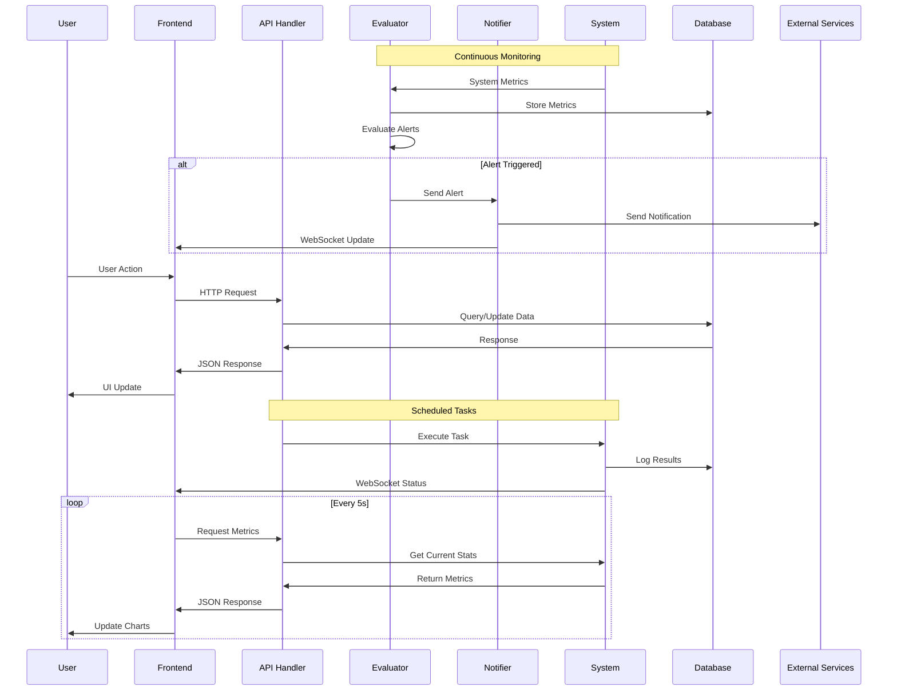

# Argus System Monitor

A comprehensive real-time Linux system performance monitoring and alerting web application **composed of a robust Go (Gin) backend and a modern React (Vite) frontend**. The backend provides RESTful APIs, WebSocket endpoints, and business logic, while the frontend delivers an interactive dashboard and management UI. Both layers are tightly integrated for a seamless user experience.

## 🚀 Latest Updates (v1.2.0)

- **Enhanced Alert System**: Advanced alert configurations with multiple severity levels (info, warning, critical)
- **Smart Notifications**: Real-time notification system with email, webhook, and Slack integration
- **Task Management**: Comprehensive task scheduling and execution system with cron-based automation
- **WebSocket Support**: Real-time bidirectional communication for live updates
- **Modern UI**: Updated React 19.1.0 with Chart.js 4.5.0 for enhanced visualizations
- **Improved Error Handling**: Better error management and user feedback
- **Enhanced Metrics**: Extended system metrics collection with process-level monitoring

## ✨ Features

- **Real-time Monitoring**: CPU, memory, network, load average, and process metrics
- **Interactive Dashboard**: Modern React UI with live charts and WebSocket connection
- **Advanced Alerting**: Configurable alerts with threshold-based triggers and multiple notification channels
- **Task Scheduling**: Cron-based system maintenance, health checks, and automated cleanup
- **Notification System**: Multi-channel notifications (email, webhook, Slack) with read/unread status
- **RESTful API**: Clean endpoints for system metrics, alerts, tasks, and notifications
- **WebSocket Integration**: Real-time bidirectional communication for live updates
- **Dockerized**: Production-ready multi-stage Docker build with optimized layers
- **Configurable**: YAML-based configuration with environment variable overrides
- **Single Page Application**: Fully responsive React frontend with automatic API integration

## 🏗️ System Architecture

```mermaid
graph TB
    %% User Interface Layer
    subgraph "Frontend (React)"
        UI[Dashboard UI]
        Charts[Live Charts]
        Alerts[Alert Manager]
        Tasks[Task Manager]
        WS_CLIENT[WebSocket Client]
    end

    %% Backend Layer
    subgraph "Backend (Go/Gin)"
        subgraph "HTTP API Layer"
            API[API Router]
            HANDLERS[HTTP Handlers]
            WS_HANDLER[WebSocket Handler]
        end
        
        subgraph "Business Logic Layer"
            EVALUATOR[Alert Evaluator]
            NOTIFIER[Notification Service]
            SCHEDULER[Task Scheduler]
            TASK_RUNNER[Task Runner]
        end
        
        subgraph "Data Layer"
            ALERT_STORE[Alert Store]
            TASK_REPO[Task Repository]
            CONFIG_STORE[Config Store]
        end
    end

    %% External Services
    subgraph "External Services"
        EMAIL[Email Provider]
        SLACK[Slack API]
        WEBHOOK[Webhooks]
    end

    %% System Resources
    subgraph "System Resources"
        CPU[CPU Metrics]
        MEMORY[Memory Metrics]
        NETWORK[Network Stats]
        PROCESSES[Process Info]
        LOAD[Load Average]
    end

    %% Static Assets
    subgraph "Static Assets"
        HTML[HTML Files]
        CSS[CSS Styles]
        JS[JavaScript]
    end

    %% Connections
    UI --> API
    Charts --> API
    Alerts --> API
    Tasks --> API
    
    WS_CLIENT <--> WS_HANDLER
    
    API --> HANDLERS
    HANDLERS --> EVALUATOR
    HANDLERS --> NOTIFIER
    HANDLERS --> SCHEDULER
    HANDLERS --> TASK_RUNNER
    
    EVALUATOR --> ALERT_STORE
    SCHEDULER --> TASK_REPO
    HANDLERS --> CONFIG_STORE
    
    NOTIFIER --> EMAIL
    NOTIFIER --> SLACK
    NOTIFIER --> WEBHOOK
    
    EVALUATOR --> CPU
    EVALUATOR --> MEMORY
    EVALUATOR --> NETWORK
    EVALUATOR --> PROCESSES
    EVALUATOR --> LOAD
    
    TASK_RUNNER --> CPU
    TASK_RUNNER --> MEMORY
    TASK_RUNNER --> NETWORK
    
    API --> HTML
    API --> CSS
    API --> JS
    
    WS_HANDLER --> WS_CLIENT
    
    %% Styling
    classDef frontend fill:#e1f5fe,stroke:#01579b,stroke-width:2px
    classDef backend fill:#f3e5f5,stroke:#4a148c,stroke-width:2px
    classDef external fill:#e8f5e8,stroke:#1b5e20,stroke-width:2px
    classDef system fill:#fff3e0,stroke:#e65100,stroke-width:2px
    classDef storage fill:#fce4ec,stroke:#880e4f,stroke-width:2px
    classDef static fill:#f1f8e9,stroke:#33691e,stroke-width:2px
    
    class UI,Charts,Alerts,Tasks,WS_CLIENT frontend
    class API,HANDLERS,WS_HANDLER,EVALUATOR,NOTIFIER,SCHEDULER,TASK_RUNNER backend
    class EMAIL,SLACK,WEBHOOK external
    class CPU,MEMORY,NETWORK,PROCESSES,LOAD system
    class ALERT_STORE,TASK_REPO,CONFIG_STORE storage
    class HTML,CSS,JS static
```



### Data Flow Architecture



## Project Structure

```text
argus/
├── cmd/argus/main.go          # Main application entry point (backend)
├── internal/                  # Internal backend packages (config, server, services, handlers, models, database)
├── web/                       # Frontend and static assets
│   └── argus-react/           # React (Vite) SPA frontend source
├── Dockerfile                 # Multi-stage Docker build
├── docker-compose.yml         # Dev/prod orchestration
├── config.example.yaml        # Config template
├── Makefile                   # Build and workflow automation
├── go.mod                     # Go module
├── README.md                  # Project documentation
└── docs/                      # Architecture, PRD, and API docs
```

## 🛠️ Technology Stack

### Backend (API & Business Logic)

- **Go 1.23.8** - Core runtime
- **Gin 1.9.1** - HTTP web framework
- **Gorilla WebSocket 1.5.0** - Real-time communication
- **Robfig Cron v3.0.1** - Task scheduling
- **gopsutil 3.21.11** - System metrics collection
- **UUID 1.6.0** - Unique identifiers
- **YAML v3.0.1** - Configuration management

### Frontend (SPA Dashboard)

- **React 19.1.0** - UI framework
- **TypeScript 5.8.3** - Type-safe JavaScript
- **Vite 7.0.0** - Build tool and dev server
- **Chart.js 4.5.0** - Data visualization
- **React Chart.js 2 5.3.0** - React wrapper for Chart.js

### Infrastructure

- **Docker** - Containerization
- **Docker Compose** - Multi-container orchestration
- **Multi-stage builds** - Optimized container images

## Project Analysis: Frontend & Backend Integration

Argus is architected as a full-stack application with clear separation and integration between frontend and backend:

- **Backend (Go/Gin):**
  - Exposes RESTful APIs for system metrics, alerts, tasks, and notifications
  - Provides a WebSocket endpoint for real-time updates
  - Handles business logic, alert evaluation, task scheduling, and notification delivery
  - Serves the built frontend SPA in production

- **Frontend (React/Vite):**
  - Implements a responsive, interactive dashboard for monitoring and management
  - Communicates with the backend via REST APIs and WebSocket
  - Visualizes system metrics, alerts, and tasks in real time
  - Provides user interfaces for configuration, alerting, and task management

**Integration:**

- During development, the frontend runs on its own dev server and proxies API requests to the backend.
- In production, the backend serves the static frontend assets from the `web/release/` directory.
- Both layers are containerized for easy deployment and orchestration.

## Development Workflow

### Prerequisites

- Go 1.23+
- Node.js 18+ and npm
- Docker & docker-compose (for containerized workflow)

### Common Makefile Commands

| Command            | Description                                 |
|--------------------|---------------------------------------------|
| `make build`       | Build both backend and frontend              |
| `make build-frontend` | Build frontend and copy to release directory |
| `make build-backend`  | Build Go backend only                      |
| `make clean`       | Clean build artifacts                        |
| `make analyze`     | Run static analysis to find unused code      |

### Local Development (Recommended)

1. **Build the project (backend and frontend):**

   ```bash
   make build
   ```

2. **Run the backend server:**

   ```bash
   ./release/bin/argus
   ```

   - The backend will serve the built frontend SPA from `release/web/` at [http://localhost:8080](http://localhost:8080).

3. **(Optional) Frontend development mode:**
   - For hot-reloading and faster frontend development, you can run the React dev server separately:

   ```bash
   cd web/argus-react
   npm install
   npm run dev
   ```

   - The frontend will be available at [http://localhost:5173](http://localhost:5173) and will proxy API requests to the backend.

4. **Access the app:**
   - Production mode: [http://localhost:8080](http://localhost:8080)
   - Frontend dev mode: [http://localhost:5173](http://localhost:5173)

### Production Build

1. **Build everything:**

   ```bash
   make build
   ```

2. **Run the backend:**

   ```bash
   ./bin/argus
   ```

   - Serves the React SPA from `web/release/` (built by frontend)

### Configuration

The application uses a YAML configuration file. Copy `config.example.yaml` to `config.yaml` and customize as needed:

```yaml
server:
    port: 8080
    host: "localhost"
    read_timeout: "30s"
    write_timeout: "30s"

debug:
    enabled: true
    pprof_enabled: true
    pprof_path: "/debug/pprof"
    benchmark_enabled: true

monitoring:
    update_interval: "5s"
    metrics_retention: "24h"
    process_limit: 500

alerts:
    enabled: true
    storage_path: "./.argus/alerts"
    notification_interval: "1m"

tasks:
    enabled: true
    storage_path: "./.argus/tasks"
    max_concurrent: 5

storage:
    base_path: "./.argus"
    file_permissions: 0644
    backup_enabled: true

logging:
    level: "info"
    format: "json"
    file: ""

websocket:
    enabled: true
    path: "/ws"
    read_buffer_size: 1024
    write_buffer_size: 1024

cors:
    enabled: true
    allowed_origins: ["http://localhost:3000", "http://localhost:5173"]
    allowed_methods: ["GET", "POST", "PUT", "DELETE", "OPTIONS"]
    allowed_headers: ["Content-Type", "Authorization"]
```

- Edit `config.yaml` to match your environment and security requirements.
- Environment variables can override any configuration value (e.g. `ARGUS_SERVER_PORT=9090`).

### Directory Conventions

- Backend code: `internal/`
- Backend entrypoint: `cmd/argus/main.go`
- Frontend app: `web/argus-react/`
- Built frontend assets: `release/web/`
- Backend binary: `release/bin/argus`
- Config: `config.yaml`
- Docs: `docs/`

## API Endpoints

### System Metrics

- `GET /api/metrics` - Get all system metrics
- `GET /api/metrics/cpu` - Get CPU usage
- `GET /api/metrics/memory` - Get memory usage  
- `GET /api/metrics/network` - Get network statistics
- `GET /api/metrics/load` - Get system load average

### Alerts Management

- `GET /api/alerts` - List all alert configurations
- `POST /api/alerts` - Create new alert
- `PUT /api/alerts/:id` - Update alert configuration
- `DELETE /api/alerts/:id` - Delete alert
- `GET /api/alerts/status` - Get alert status
- `POST /api/alerts/test/:id` - Test alert configuration

### Notifications

- `GET /api/alerts/notifications` - Get all notifications
- `POST /api/alerts/notifications/:id/read` - Mark notification as read
- `POST /api/alerts/notifications/read-all` - Mark all notifications as read
- `DELETE /api/alerts/notifications` - Clear all notifications

### Task Management

- `GET /api/tasks` - List all tasks
- `POST /api/tasks` - Create new task
- `PUT /api/tasks/:id` - Update task
- `DELETE /api/tasks/:id` - Delete task
- `POST /api/tasks/:id/run` - Execute task manually

### WebSocket

- `ws://localhost:8080/ws` - WebSocket endpoint for real-time updates

For detailed API documentation, see [docs/api_documentation.md](docs/api_documentation.md).

## 🚀 Quick Start

### Local Development

```bash
# Clone and setup
git clone https://github.com/yourusername/argus.git
cd argus

# Build backend and frontend
make build

# Copy and configure
cp config.example.yaml config.yaml
# Edit config.yaml as needed

# Run backend server
./release/bin/argus

# (Optional) For frontend development with hot reload:
cd web/argus-react
npm install
npm run dev
# Access frontend at http://localhost:5173 (proxies API to backend)
```

## 🔧 Configuration

The application uses a YAML configuration file. Copy `config.example.yaml` to `config.yaml` and customize as needed:

```yaml
server:
    port: 8080
    host: "localhost"
    read_timeout: "30s"
    write_timeout: "30s"

debug:
    enabled: true
    pprof_enabled: true
    pprof_path: "/debug/pprof"
    benchmark_enabled: true

monitoring:
    update_interval: "5s"
    metrics_retention: "24h"
    process_limit: 500

alerts:
    enabled: true
    storage_path: "./.argus/alerts"
    notification_interval: "1m"

tasks:
    enabled: true
    storage_path: "./.argus/tasks"
    max_concurrent: 5

storage:
    base_path: "./.argus"
    file_permissions: 0644
    backup_enabled: true

logging:
    level: "info"
    format: "json"
    file: ""

websocket:
    enabled: true
    path: "/ws"
    read_buffer_size: 1024
    write_buffer_size: 1024

cors:
    enabled: true
    allowed_origins: ["http://localhost:3000", "http://localhost:5173"]
    allowed_methods: ["GET", "POST", "PUT", "DELETE", "OPTIONS"]
    allowed_headers: ["Content-Type", "Authorization"]
```

- Edit `config.yaml` to match your environment and security requirements.
- Environment variables can override any configuration value (e.g. `ARGUS_SERVER_PORT=9090`).

## 🐛 Troubleshooting

### Common Issues

#### Port Already in Use

```bash
# Check what's using port 8080
sudo lsof -i :8080

# Use a different port
export ARGUS_SERVER_PORT=9090
```

#### WebSocket Connection Failed

- Check if the backend is running
- Verify the WebSocket endpoint URL
- Check browser console for error messages
- Ensure no firewall blocking the connection

#### Alert Notifications Not Working

- Verify SMTP configuration for email alerts
- Check webhook URLs are accessible
- Validate Slack webhook configuration
- Review logs for error messages

### Debug Mode

Enable debug logging:

```bash
export ARGUS_LOG_LEVEL=debug
```

Or in config.yaml:

```yaml
logging:
  level: debug
  format: json
```

### Development Standards

- Follow Go formatting standards (`gofmt`)
- Write tests for new functionality
- Update documentation for API changes
- Use conventional commit messages
- Ensure all CI checks pass

### Project Structure Guidelines

- Backend code: `internal/`
- Backend entrypoint: `cmd/argus/main.go`
- Frontend code: `web/argus-react/src/`
- Built frontend: `release/web/`
- Backend binary: `release/bin/argus`
- Tests: `*_test.go` files
- Documentation: `docs/`
- Examples: `examples/`

## 📚 Additional Resources

- [Architecture Documentation](docs/framework_directory.md)
- [API Reference](docs/api_documentation.md)
- [Production Deployment Guide](docs/argus_prd.md)

## License

MIT License - see [LICENSE](LICENSE) for details.

---

Built with ❤️ by the Argus team
