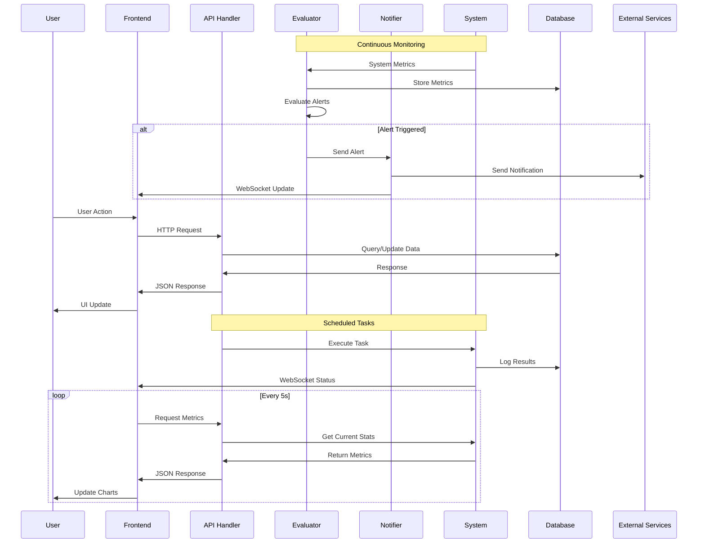

# Argus System Monitor

A comprehensive real-time Linux system performance monitoring and alerting web application built with Go (Gin) backend and React (Vite) frontend.

## 🚀 Latest Updates (v1.2.0)

- **Enhanced Alert System**: Advanced alert configurations with multiple severity levels (info, warning, critical)
- **Smart Notifications**: Real-time notification system with email, webhook, and Slack integration
- **Task Management**: Comprehensive task scheduling and execution system with cron-based automation
- **WebSocket Support**: Real-time bidirectional communication for live updates
- **Modern UI**: Updated React 19.1.0 with Chart.js 4.5.0 for enhanced visualizations
- **Improved Error Handling**: Better error management and user feedback
- **Enhanced Metrics**: Extended system metrics collection with process-level monitoring

## ✨ Features

- **Real-time Monitoring**: CPU, memory, network, load average, and process metrics
- **Interactive Dashboard**: Modern React UI with live charts and WebSocket connection
- **Advanced Alerting**: Configurable alerts with threshold-based triggers and multiple notification channels
- **Task Scheduling**: Cron-based system maintenance, health checks, and automated cleanup
- **Notification System**: Multi-channel notifications (email, webhook, Slack) with read/unread status
- **RESTful API**: Clean endpoints for system metrics, alerts, tasks, and notifications
- **WebSocket Integration**: Real-time bidirectional communication for live updates
- **Dockerized**: Production-ready multi-stage Docker build with optimized layers
- **Configurable**: YAML-based configuration with environment variable overrides
- **Single Page Application**: Fully responsive React frontend with automatic API integration

## 🏗️ System Architecture

```mermaid
graph TB
    %% User Interface Layer
    subgraph "Frontend (React)"
        UI[Dashboard UI]
        Charts[Live Charts]
        Alerts[Alert Manager]
        Tasks[Task Manager]
        WS_CLIENT[WebSocket Client]
    end

    %% Backend Layer
    subgraph "Backend (Go/Gin)"
        subgraph "HTTP API Layer"
            API[API Router]
            HANDLERS[HTTP Handlers]
            WS_HANDLER[WebSocket Handler]
        end
        
        subgraph "Business Logic Layer"
            EVALUATOR[Alert Evaluator]
            NOTIFIER[Notification Service]
            SCHEDULER[Task Scheduler]
            TASK_RUNNER[Task Runner]
        end
        
        subgraph "Data Layer"
            ALERT_STORE[Alert Store]
            TASK_REPO[Task Repository]
            CONFIG_STORE[Config Store]
        end
    end

    %% External Services
    subgraph "External Services"
        EMAIL[Email Provider]
        SLACK[Slack API]
        WEBHOOK[Webhooks]
    end

    %% System Resources
    subgraph "System Resources"
        CPU[CPU Metrics]
        MEMORY[Memory Metrics]
        NETWORK[Network Stats]
        PROCESSES[Process Info]
        LOAD[Load Average]
    end

    %% Static Assets
    subgraph "Static Assets"
        HTML[HTML Files]
        CSS[CSS Styles]
        JS[JavaScript]
    end

    %% Connections
    UI --> API
    Charts --> API
    Alerts --> API
    Tasks --> API
    
    WS_CLIENT <--> WS_HANDLER
    
    API --> HANDLERS
    HANDLERS --> EVALUATOR
    HANDLERS --> NOTIFIER
    HANDLERS --> SCHEDULER
    HANDLERS --> TASK_RUNNER
    
    EVALUATOR --> ALERT_STORE
    SCHEDULER --> TASK_REPO
    HANDLERS --> CONFIG_STORE
    
    NOTIFIER --> EMAIL
    NOTIFIER --> SLACK
    NOTIFIER --> WEBHOOK
    
    EVALUATOR --> CPU
    EVALUATOR --> MEMORY
    EVALUATOR --> NETWORK
    EVALUATOR --> PROCESSES
    EVALUATOR --> LOAD
    
    TASK_RUNNER --> CPU
    TASK_RUNNER --> MEMORY
    TASK_RUNNER --> NETWORK
    
    API --> HTML
    API --> CSS
    API --> JS
    
    WS_HANDLER --> WS_CLIENT
    
    %% Styling
    classDef frontend fill:#e1f5fe,stroke:#01579b,stroke-width:2px
    classDef backend fill:#f3e5f5,stroke:#4a148c,stroke-width:2px
    classDef external fill:#e8f5e8,stroke:#1b5e20,stroke-width:2px
    classDef system fill:#fff3e0,stroke:#e65100,stroke-width:2px
    classDef storage fill:#fce4ec,stroke:#880e4f,stroke-width:2px
    classDef static fill:#f1f8e9,stroke:#33691e,stroke-width:2px
    
    class UI,Charts,Alerts,Tasks,WS_CLIENT frontend
    class API,HANDLERS,WS_HANDLER,EVALUATOR,NOTIFIER,SCHEDULER,TASK_RUNNER backend
    class EMAIL,SLACK,WEBHOOK external
    class CPU,MEMORY,NETWORK,PROCESSES,LOAD system
    class ALERT_STORE,TASK_REPO,CONFIG_STORE storage
    class HTML,CSS,JS static
```



### Data Flow Architecture



## Project Structure

```text
argus/
├── cmd/argus/main.go          # Main application entry point
├── internal/                  # Internal packages (config, server, services, handlers, models, database)
├── web/                       # Frontend assets
│   ├── argus-react/           # React (Vite) SPA frontend source
│   └── release/               # Built React SPA for production
├── Dockerfile                 # Multi-stage Docker build
├── docker-compose.yml         # Dev/prod orchestration
├── config.example.yaml        # Config template
├── Makefile                   # Build and workflow automation
├── go.mod                     # Go module
├── README.md                  # Project documentation
└── docs/                      # Architecture, PRD, and API docs
```

## 🛠️ Technology Stack

### Backend

- **Go 1.23.8** - Core runtime
- **Gin 1.9.1** - HTTP web framework
- **Gorilla WebSocket 1.5.0** - Real-time communication
- **Robfig Cron v3.0.1** - Task scheduling
- **gopsutil 3.21.11** - System metrics collection
- **UUID 1.6.0** - Unique identifiers
- **YAML v3.0.1** - Configuration management

### Frontend

- **React 19.1.0** - UI framework
- **TypeScript 5.8.3** - Type-safe JavaScript
- **Vite 7.0.0** - Build tool and dev server
- **Chart.js 4.5.0** - Data visualization
- **React Chart.js 2 5.3.0** - React wrapper for Chart.js

### Infrastructure

- **Docker** - Containerization
- **Docker Compose** - Multi-container orchestration
- **Multi-stage builds** - Optimized container images

## Development Workflow

### Prerequisites

- Go 1.23+
- Node.js 18+ and npm
- Docker & docker-compose (for containerized workflow)

### Common Makefile Commands

| Command            | Description                                 |
|--------------------|---------------------------------------------|
| `make build`       | Build backend and frontend for production   |
| `make dev`         | Run backend (auto-reload) & frontend (Vite) |
| `make web-dev`     | Run frontend dev server only                |
| `make web-build`   | Build frontend for production               |
| `make clean`       | Clean all build artifacts                   |
| `make deps`        | Install Go and frontend dependencies        |
| `make lint`        | Lint Go code                                |
| `make web-lint`    | Lint frontend code                          |
| `make docker-up`   | Start all services with docker-compose      |
| `make docker-down` | Stop all docker-compose services            |
| `make docker-build`| Build Docker image                          |

### Local Development (Recommended)

1. **Install dependencies:**

   ```bash
   make deps
   ```

2. **Start dev servers (backend + frontend):**

   ```bash
   make dev
   ```

   - Backend: [http://localhost:8080](http://localhost:8080)
   - Frontend: [http://localhost:5173](http://localhost:5173)

3. **Access the app:**
   - During development: Open [http://localhost:5173](http://localhost:5173) for the React dashboard.
   - Backend server with React: [http://localhost:8080](http://localhost:8080)

### Production Build

1. **Build everything:**

   ```bash
   make build
   ```

2. **Run the backend:**

   ```bash
   ./bin/argus
   ```

   - Serves the React SPA from `web/release/` (built by frontend)

### Docker Workflow

1. **Build and start all services:**

   ```bash
   make docker-up
   ```

   - Backend: [http://localhost:8080](http://localhost:8080)
   - Frontend (dev): [http://localhost:5173](http://localhost:5173)

2. **Stop all services:**

   ```bash
   make docker-down
   ```

3. **View logs:**

   ```bash
   make docker-logs
   ```

### Testing & Linting

- **Go tests:**

  ```bash
  make test
  ```

- **Frontend lint:**

  ```bash
  make web-lint
  ```

- **Go lint:**

  ```bash
  make lint
  ```

### Configuration

- Copy `config.example.yaml` to `config.yaml` and edit as needed.
- Environment variables can override config values (see docs/framework_directory.md).

### Directory Conventions

- Backend code: `internal/`
- Frontend app: `web/argus-react/`
- Static assets: `web/static/`
- Config: `config.yaml`
- Docs: `docs/`

## API Endpoints

### System Metrics

- `GET /api/v1/metrics` - Get all system metrics
- `GET /api/v1/metrics/cpu` - Get CPU usage
- `GET /api/v1/metrics/memory` - Get memory usage  
- `GET /api/v1/metrics/network` - Get network statistics
- `GET /api/v1/metrics/load` - Get system load average

### Alerts Management

- `GET /api/v1/alerts` - List all alert configurations
- `POST /api/v1/alerts` - Create new alert
- `PUT /api/v1/alerts/:id` - Update alert configuration
- `DELETE /api/v1/alerts/:id` - Delete alert
- `GET /api/v1/alerts/status` - Get alert status
- `POST /api/v1/alerts/test/:id` - Test alert configuration

### Task Management

- `GET /api/v1/tasks` - List all tasks
- `POST /api/v1/tasks` - Create new task
- `PUT /api/v1/tasks/:id` - Update task
- `DELETE /api/v1/tasks/:id` - Delete task
- `POST /api/v1/tasks/:id/run` - Execute task manually

### Notifications

- `GET /api/v1/alerts/notifications` - Get all notifications
- `POST /api/v1/alerts/notifications/:id/read` - Mark notification as read
- `POST /api/v1/alerts/notifications/read-all` - Mark all notifications as read
- `DELETE /api/v1/alerts/notifications` - Clear all notifications

### WebSocket

- `ws://localhost:8080/ws` - WebSocket endpoint for real-time updates

For detailed API documentation, see [docs/api_documentation.md](docs/api_documentation.md).

## 🚀 Quick Start

### Option 1: Docker (Recommended)

```bash
# Clone the repository
git clone https://github.com/yourusername/argus.git
cd argus

# Start with Docker Compose
make docker-up

# Access the application
# - Frontend: http://localhost:8080
# - API: http://localhost:8080/api/v1/
```

### Option 2: Local Development

```bash
# Clone and setup
git clone https://github.com/yourusername/argus.git
cd argus

# Install dependencies
make deps

# Copy and configure
cp config.example.yaml config.yaml
# Edit config.yaml as needed

# Start development servers
make dev

# Access the application
# - Frontend: http://localhost:5173
# - Backend: http://localhost:8080
```

## 📊 Screenshots

### Dashboard Overview


### Alert Configuration


### Task Scheduler


## 🔧 Configuration

The application uses a YAML configuration file. Copy `config.example.yaml` to `config.yaml`:

```yaml
server:
  port: 8080
  host: "0.0.0.0"
  
alerts:
  check_interval: "30s"
  notification_timeout: "5m"
  
tasks:
  max_concurrent: 5
  default_timeout: "10m"
  
notifications:
  email:
    smtp_server: "smtp.gmail.com"
    smtp_port: 587
    username: "your-email@gmail.com"
    password: "your-app-password"
  
  slack:
    webhook_url: "https://hooks.slack.com/services/YOUR/SLACK/WEBHOOK"
    
  webhook:
    url: "https://your-webhook-endpoint.com"
    timeout: "10s"
```

Environment variables can override any configuration value:

```bash
export ARGUS_SERVER_PORT=9090
export ARGUS_ALERTS_CHECK_INTERVAL=60s
```

## 🐛 Troubleshooting

### Common Issues

#### Port Already in Use

```bash
# Check what's using port 8080
sudo lsof -i :8080

# Use a different port
export ARGUS_SERVER_PORT=9090
```

#### WebSocket Connection Failed

- Check if the backend is running
- Verify the WebSocket endpoint URL
- Check browser console for error messages
- Ensure no firewall blocking the connection

#### Alert Notifications Not Working

- Verify SMTP configuration for email alerts
- Check webhook URLs are accessible
- Validate Slack webhook configuration
- Review logs for error messages

#### Docker Issues

```bash
# Clean up Docker resources
make docker-down
docker system prune -f

# Rebuild containers
make docker-build
make docker-up
```

### Debug Mode

Enable debug logging:

```bash
export ARGUS_LOG_LEVEL=debug
```

Or in config.yaml:

```yaml
logging:
  level: debug
  format: json
```

## 🤝 Contributing

We welcome contributions! Please follow these guidelines:

1. **Fork the repository**
2. **Create a feature branch**: `git checkout -b feature/amazing-feature`
3. **Make your changes**
4. **Run tests**: `make test`
5. **Run linting**: `make lint && make web-lint`
6. **Commit your changes**: `git commit -m 'Add amazing feature'`
7. **Push to the branch**: `git push origin feature/amazing-feature`
8. **Open a Pull Request**

### Development Standards

- Follow Go formatting standards (`gofmt`)
- Write tests for new functionality
- Update documentation for API changes
- Use conventional commit messages
- Ensure all CI checks pass

### Project Structure Guidelines

- Backend code: `internal/`
- Frontend code: `web/argus-react/src/`
- Tests: `*_test.go` files
- Documentation: `docs/`
- Examples: `examples/`

## 📈 Performance

### Metrics Collection

- **CPU**: Updated every 5 seconds
- **Memory**: Updated every 5 seconds  
- **Network**: Updated every 10 seconds
- **Load Average**: Updated every 15 seconds

### Resource Usage

- **Memory**: ~50MB baseline
- **CPU**: <5% during normal operation
- **Network**: Minimal overhead
- **Disk**: Log rotation prevents disk buildup

## 🔒 Security

- No sensitive data stored in logs
- Configuration supports environment variables
- HTTPS support for production deployments
- Input validation on all API endpoints
- Rate limiting on API endpoints

## 📚 Additional Resources

- [Architecture Documentation](docs/framework_directory.md)
- [API Reference](docs/api_documentation.md)
- [Production Deployment Guide](docs/argus_prd.md)
- [Example Configurations](examples/)

## License

MIT License - see [LICENSE](LICENSE) for details.

## 🏷️ Version History

- **v1.2.0** (Current) - Enhanced alert system, notifications, task management
- **v1.1.0** - WebSocket support, improved UI
- **v1.0.0** - Initial release with basic monitoring

## 📧 Support

For issues and questions:

- Create an issue on GitHub
- Check the documentation in `docs/`
- Review the troubleshooting section above

---

Built with ❤️ by the Argus team
